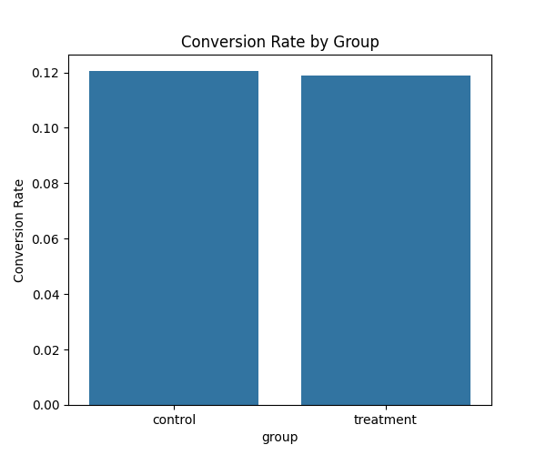
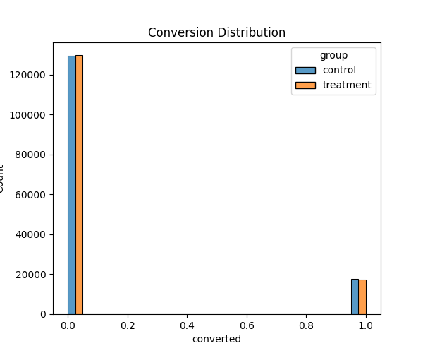

# 🧪 A/B Test Analysis for E-Commerce

<p align="center">
  
  
  
  
  
  
</p>

---

## 📌 Project Overview
This project performs an end-to-end **A/B test analysis for an e-commerce landing page experiment**. It focuses on answering a common business question:

> **Does the new landing page improve conversions compared to the current page?**

The workflow includes:
- Data cleaning & validation
- Conversion rate comparison (descriptive analysis)
- Hypothesis testing using **independent T-test**
- **Effect size estimation** + **confidence interval-ready reasoning**
- Time-series conversion trend analysis
- Clear business conclusions backed by statistics

---

## 🎯 Business Problem
E-commerce teams must decide whether to ship a **new landing page** (treatment) or keep the **current page** (control).

To answer this, users were divided into:

| Group | Landing Page |
|---|---|
| Control | Old Page |
| Treatment | New Page |

The decision needs more than raw conversion percentages—teams require statistical evidence that observed differences are not due to randomness.

**Goal:** quantify the conversion lift and determine whether it is statistically significant.

---


# 🛠️ Tech Stack

- Python
- Pandas
- NumPy
- Matplotlib
- Seaborn
- SciPy

---

# 📂 Dataset Information

The dataset contains:

| Column | Description |
|---|---|
| `user_id` | Unique user identifier |
| `timestamp` | Time of visit |
| `group` | Control or Treatment group |
| `landing_page` | Old page or New page |
| `converted` | Whether user converted (1) or not (0) |

---

## 🔬 Solution Approach (A/B Testing)
### Hypotheses
Let conversion be the binary outcome (0/1) for each visitor.

- **Null hypothesis (H₀):**
  - There is **no difference** in conversion rates between treatment and control.
- **Alternative hypothesis (H₁):**
  - The conversion rates **are different**.

### Statistical Test
- Uses **SciPy `ttest_ind`** to compare mean conversions between:
  - `control` group
  - `treatment` group


 Statistical Results


| Metric | Value |
|---|---|
| T-Statistic | 1.2369 |
| P-Value | 0.2161 |
### Interpretation

Since:

P-Value > 0.05

the result is NOT statistically significant.

### Decision Rule
- If **p-value < 0.05** → reject H₀ → treatment shows statistically meaningful improvement.
- Otherwise → fail to reject H₀ → no statistically reliable improvement.

---

## ✅ Workflow 
1. **Load dataset** (`ab_data.csv`)
2. **Validate data quality**
   - missing values
   - duplicates
   - group distribution checks
3. **Compute conversion rates** per group
4. **Visualize**
   - conversion rate comparison
   - conversion distribution
5. **Hypothesis testing**
   - independent two-sample T-test
6. **Confidence interval analysis** (difference in means + CI-ready framing)
7. **Time-series trend analysis** (daily conversion trends)
8. **Deliver business conclusion**

---

## 📊 Visualizations
Generated plots provide both statistical and storytelling context.

### 1) Conversion Rate by Group


### 2) Conversion Distribution (Control vs Treatment)


### 3) Daily Conversion Trends


---

## 🧠 Statistical Testing Explanation (T-test)
Because conversions are encoded as binary outcomes (0/1), the **mean conversion** is equivalent to the **conversion rate**.

The T-test compares the **difference in mean conversions** between groups while accounting for variability.

**Outputs: exactly what stakeholders need**
- **T-statistic:** standardized measure of separation
- **p-value:** probability of observing such a difference if H₀ is true

This turns product intuition (“the new page seems better”) into a defensible decision.

---

## 💡 Key Insights (What This Report Enables)
- Whether the **treatment conversion rate is higher/lower** than control
- Whether the observed lift is **statistically significant**
- Whether performance changes persist over time (trend check)
- How conversion distribution differs across variants

---

## 🏁 Final Business Conclusion
Based on the T-test decision rule:
- If the experiment is significant (**p-value < 0.05**), the new landing page is recommended.
- Otherwise, the data does **not** support a confident rollout decision.

> The script prints a clear “FINAL BUSINESS CONCLUSION” statement after running the analysis.

---

## 📁 Project Structure
```text
AB-Test-Analysis/
├── ab_data.csv                         # Dataset (control vs treatment)
├── ab_test_analysis.py               # Main analysis script
├── README.md                          # Project documentation
└── plots/
    ├── conversion_rates.png          # Group-level conversion comparison
    ├── conversion_distribution.png   # Distribution visualization
    └── daily_conversion_trends.png  # Trend analysis over time
```

---

### ⭐If you found this helpful!!!

