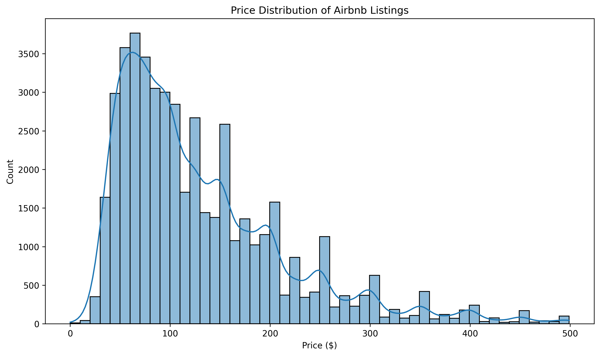
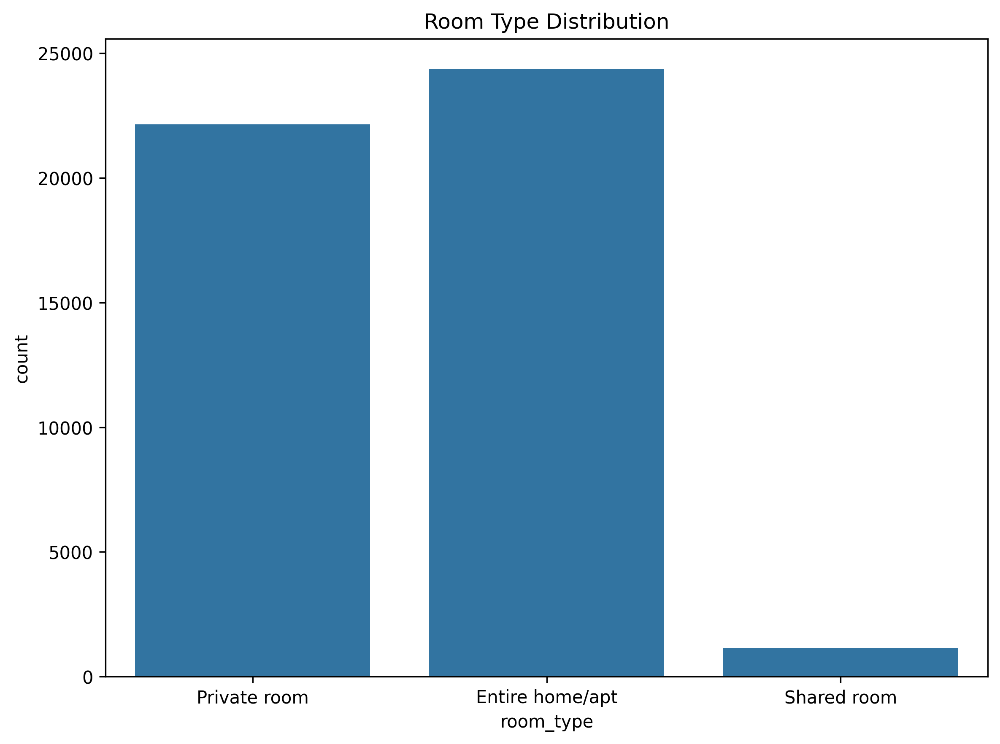
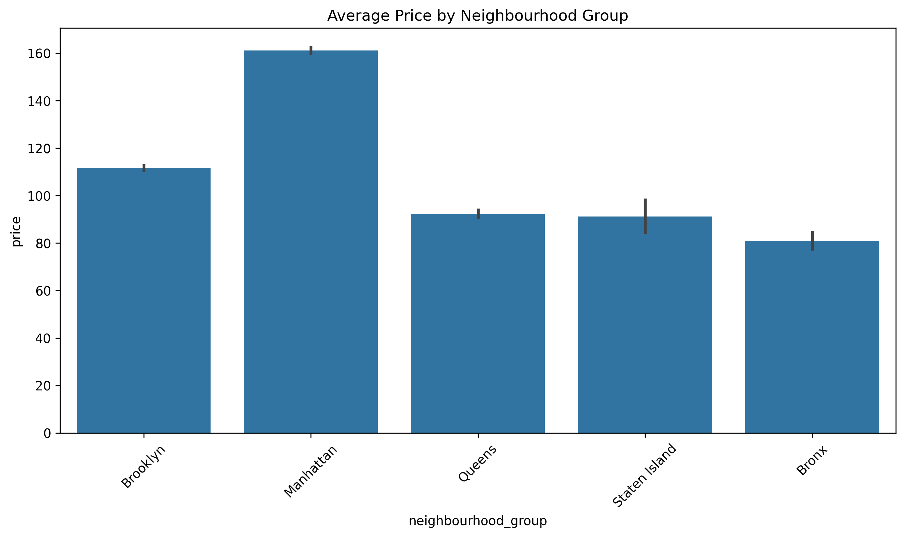
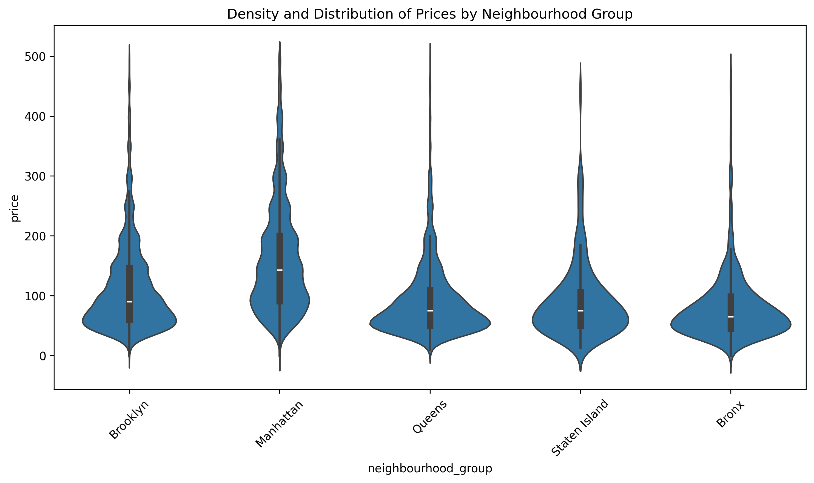
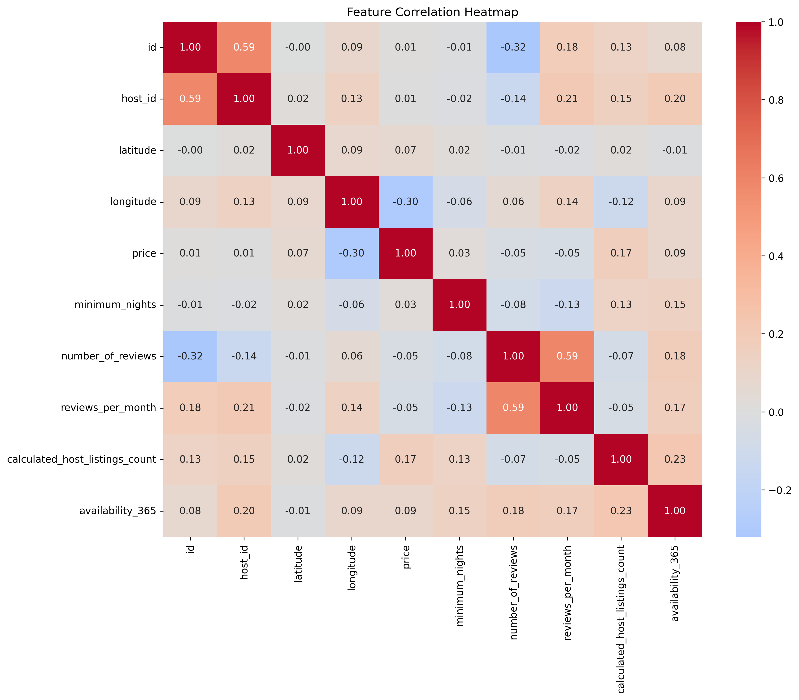
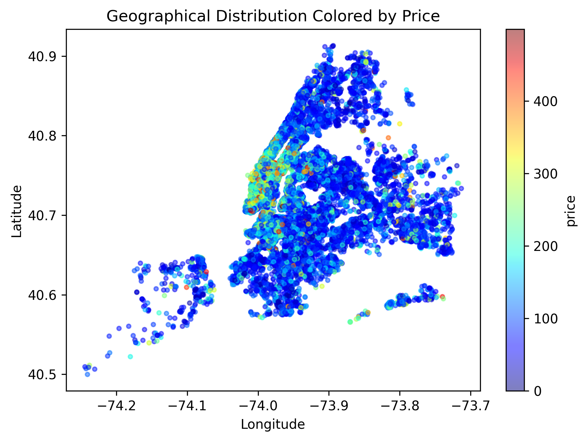
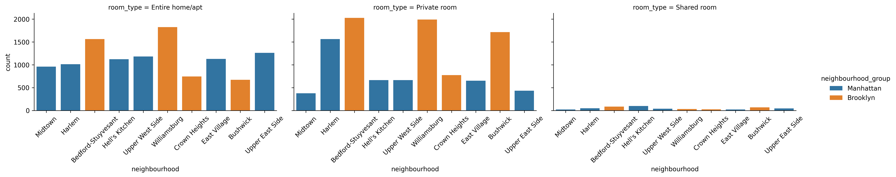

# 🏠 Airbnb NYC 2019 — Exploratory Data Analysis

> A comprehensive EDA project analyzing the Airbnb New York City 2019 dataset. This project showcases data cleaning, statistical analysis, and stunning visualizations to uncover insights about pricing, room types, and neighborhood trends.

---

## 📊 Project Overview

This project performs an end-to-end Exploratory Data Analysis (EDA) on the Airbnb NYC 2019 dataset, covering:
- **Data Loading** — Importing and inspecting raw data
- **Data Cleaning** — Handling missing values and removing price outliers
- **Statistical Analysis** — Groupby operations, pivot tables, and descriptive stats
- **Visualization** — 7 different plots revealing key patterns and trends

---

## 📁 Dataset

| Attribute | Description |
|-----------|-------------|
| **Source** | [Airbnb NYC 2019](http://data.insideairbnb.com/) |
| **Records** | ~49,000 listings |
| **Features** | 16 columns (name, host_name, neighbourhood, room_type, price, reviews, availability, etc.) |

---

## ⚙️ Workflow

```
Load → Clean → Analyze → Visualize
```

1. **Load** — Import CSV and inspect structure
2. **Clean** — Fill missing values, remove price outliers (> $500)
3. **Analyze** — Groupby, pivot tables, top listings
4. **Visualize** — Generate 7 PNG visualizations

---

## 🔍 Key Insights

- 📈 **Manhattan** has the highest average prices
- 🏠 **Entire home/apartment** is the most common listing type
- 📍 **Top neighborhoods** show significant price variation
- ⭐ **Highly reviewed listings** average ~$200/night
- 🗺️ **Geographic scatter** reveals pricing hotspots

---

## 📸 Visualizations

| Plot | Description |
|------|-------------|
|  | Price distribution histogram with KDE |
|  | Room type count distribution |
|  | Average price by neighbourhood group |
|  | Violin plot of price density by group |
|  | Feature correlation matrix |
|  | Geographic price distribution |
|  | Room type distribution by top neighbourhoods |

---

## 🚀 How to Run

```bash
# Navigate to project directory
cd Airbnb-EDA

# Run the EDA script
python airbnb_eda.py
```

**Output:**
- Console prints summary statistics
- PNG files saved to `plots/` folder

---

## 🛠️ Tech Stack

| Category | Tools |
|----------|-------|
| **Language** | Python |
| **Data Processing** | pandas, NumPy |
| **Visualization** | matplotlib, seaborn |
| **Environment** | Jupyter / VS Code |

---

## 📂 Project Structure

```
Airbnb-EDA/
├── plots/
│   ├── correlation_heatmap.png
│   ├── geo_price_scatter.png
│   ├── neighbourhood_price_density.png
│   ├── neighbourhood_price.png
│   ├── price_distribution.png
│   ├── room_type_distribution.png
│   └── top_neigh_room_dist.png
├── AB_NYC_2019.csv
├── airbnb_eda.py
└── README.md
```

---

## 🌟 Highlights

✅ Recruiter-friendly format  
✅ Clean, modular code  
✅ Professional visualizations  
✅ Actionable insights  

---
