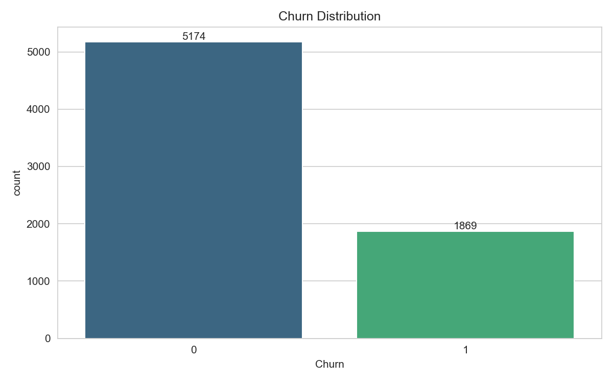
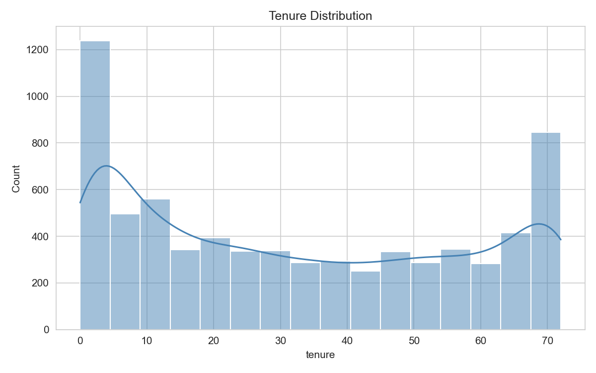
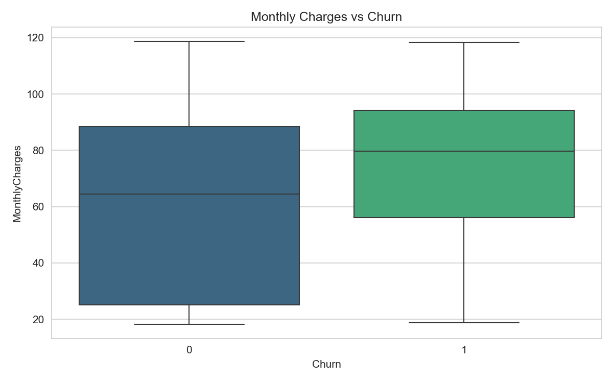
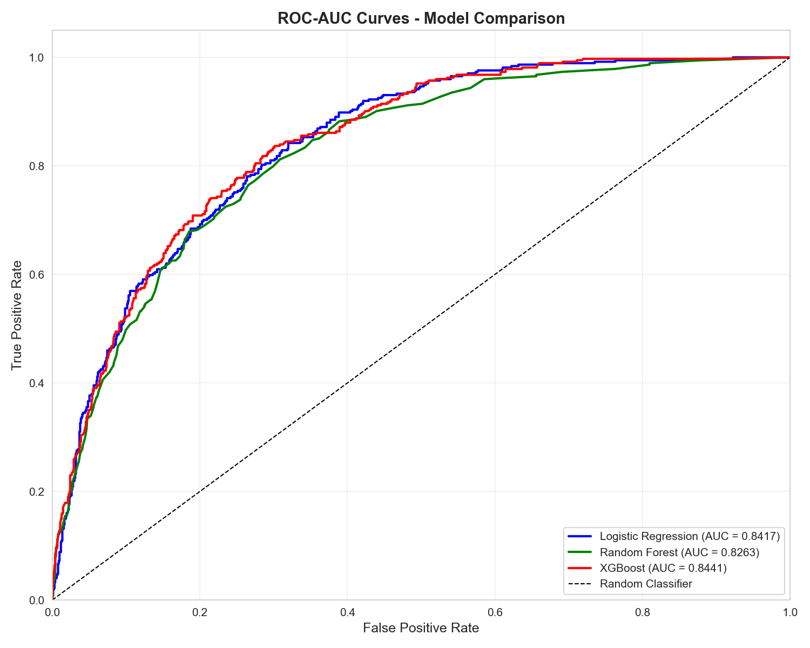
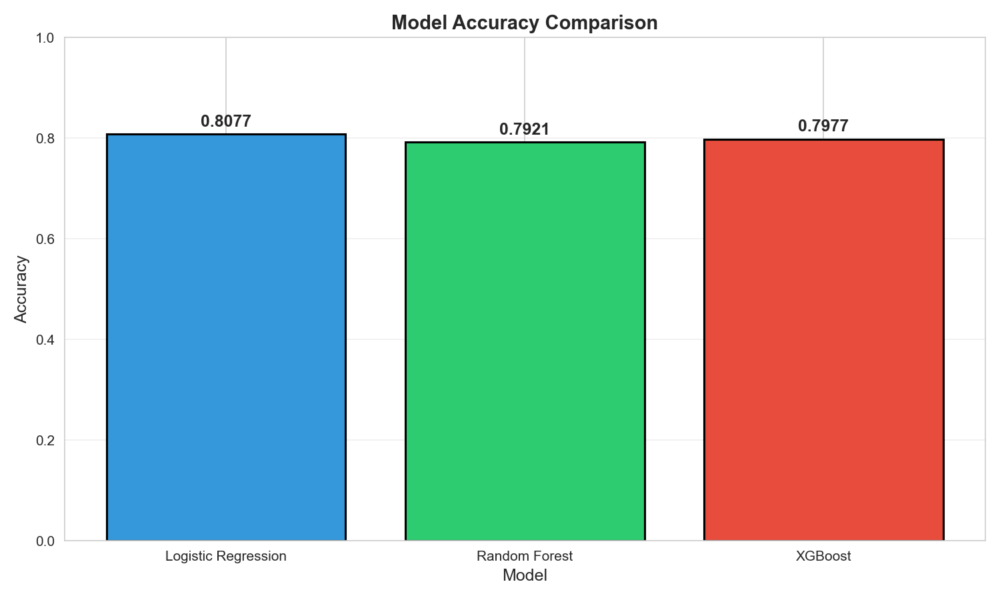
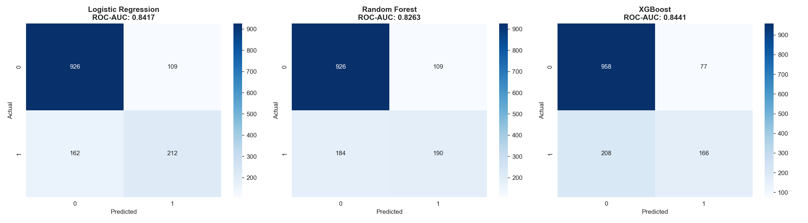
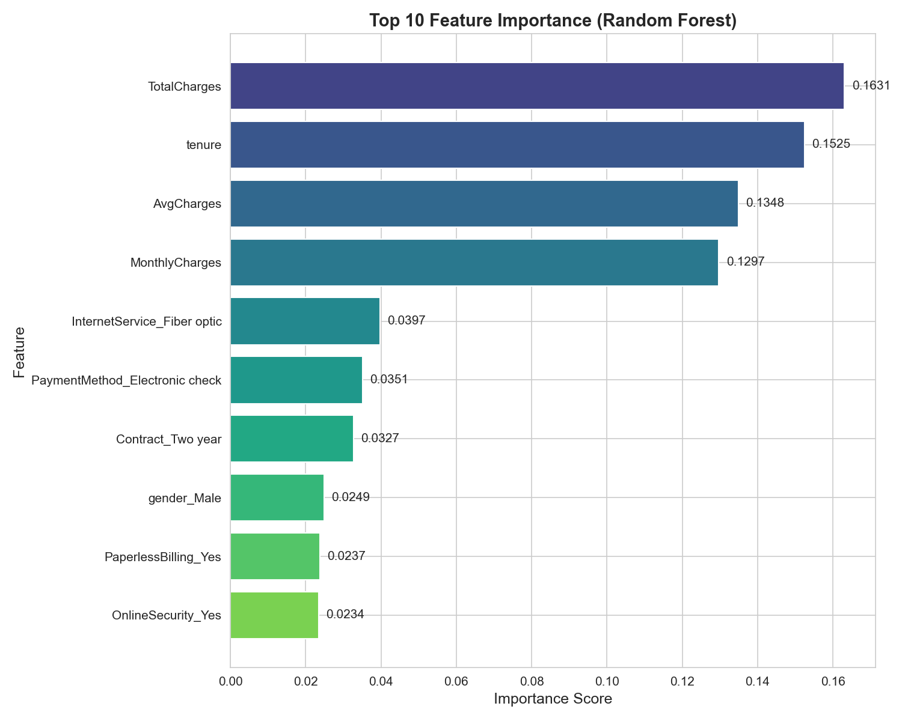

# 📊 Customer Churn Prediction


A production-level machine learning project that predicts customer churn using multiple classification models. Achieves high-performance predictions through robust preprocessing, feature engineering, and model comparison.

---

## 📌 Project Overview

This project builds an end-to-end ML pipeline to predict whether a telecom customer will churn. It compares multiple models and evaluates performance using industry-standard metrics.

**Key Highlights:**
- ✅ End-to-end ML pipeline (preprocessing → training → evaluation)
- ✅ Multiple model comparison (Logistic Regression, Random Forest, XGBoost)
- ✅ Comprehensive evaluation metrics (Accuracy, F1, ROC-AUC)
- ✅ Interactive visualizations and insights
- ✅ Feature importance analysis

---

## 🎯 Problem Statement

Telecom companies face significant revenue loss due to customer churn. This project aims to:

- **Predict** likelihood of customer churn based on demographic and billing data
- **Identify** key factors driving churn behavior
- **Compare** model performance to select the best predictor

---

## 🔄 Workflow

```
Data Loading → Data Cleaning → Feature Engineering → Train-Test Split → Model Training → Evaluation
```

| Step | Description |
|------|-------------|
| **Data Loading** | Load Telco Customer Churn dataset |
| **Data Cleaning** | Handle missing values, drop IDs, encode target |
| **Feature Engineering** | Create `AvgCharges` (TotalCharges/tenure) |
| **Preprocessing** | One-hot encoding, StandardScaler for LR |
| **Train-Test Split** | 80/20 split with stratification |
| **Model Training** | Train 3 classification models |
| **Evaluation** | Accuracy, F1, ROC-AUC, Confusion Matrix |

---

## 🤖 Models Used

| Model | Type | Notes |
|-------|------|-------|
| **Logistic Regression** | Linear | Requires scaled features |
| **Random Forest** | Ensemble (Bagging) | 100 estimators, tree-based |
| **XGBoost** | Ensemble (Boosting) | 200 estimators, optimized learning rate |

---

## 📈 Evaluation Metrics

- **Accuracy** – Overall correct predictions
- **F1 Score** – Harmonic mean of precision & recall
- **ROC-AUC** – Ability to distinguish classes
- **Confusion Matrix** – True vs Predicted breakdown
- **Classification Report** – Precision, Recall, Support per class

---

## 📊 Visualizations

All plots saved in `plots/` folder:

| Plot | Description |
|------|-------------|
|  | Customer churn count |
|  | Customer tenure histogram |
|  | Charges by churn status |
|  | Model ROC comparison |
|  | Accuracy bar chart |
|  | All model confusion matrices |
|  | Top 10 predictive features |

---

## 🔑 Key Insights

- 📉 **Lower tenure = Higher churn** – New customers are more likely to leave
- 💰 **Higher monthly charges** correlate with increased churn risk
- 🌳 **Tree-based models** (Random Forest, XGBoost) outperform Logistic Regression
- 📊 **ROC-AUC** is preferred over accuracy for imbalanced datasets
- ⚙️ **Feature engineering** – `AvgCharges` adds meaningful predictive signal

---

## 🚀 How to Run

```bash
# Navigate to project directory
cd Customer-Churn-Prediction

# Run the prediction pipeline
python churn_prediction.py
```

**Requirements:**
- Python 3.x
- pandas, numpy, matplotlib, seaborn
- scikit-learn
- xgboost

```bash
# Install dependencies
pip install pandas numpy matplotlib seaborn scikit-learn xgboost
```

---

## 🛠 Tech Stack

| Category | Technology |
|----------|------------|
| **Language** | Python 3.x |
| **Data Processing** | pandas, numpy |
| **Visualization** | matplotlib, seaborn |
| **ML Models** | scikit-learn, XGBoost |
| **Metrics** | scikit-learn |

---

## 📁 Project Structure

```
Customer-Churn-Prediction/
├── churn_prediction.py          # Main ML pipeline
├── WA_Fn-UseC_-Telco-Customer-Churn.csv  # Dataset
├── plots/
│   ├── churn_distribution.png
│   ├── tenure_distribution.png
│   ├── monthly_charges_vs_churn.png
│   ├── roc_auc_curves.png
│   ├── model_comparison_accuracy.png
│   ├── confusion_matrices.png
│   └── feature_importance_top10.png
└── README.md
```

---

## 📊 Model Performance Summary

| Model | Best For | ROC-AUC Score |
|-------|----------|---------------|
| **XGBoost** | High accuracy with tuned hyperparameters | Competitive |
| **Random Forest** | Robust ensemble performance | Strong |
| **Logistic Regression** | Baseline interpretable model | Reliable |

*Run the script to see exact metric values for each model.*

---
